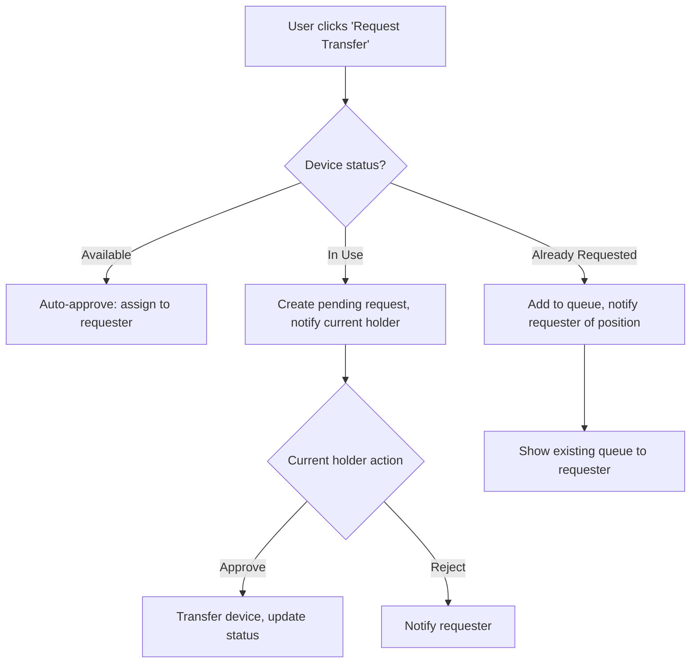

# Asset Management Tracking System — Implementation Plan

A full-stack system to track devices (e.g., target boards) assigned across project teams, with dashboard analytics, device lifecycle management, and a multi-step device transfer workflow.

## Tech Stack Decision

| Layer | Choice | Rationale |
|---|---|---|
| **Backend** | Python 3 + FastAPI | Async, auto-docs (Swagger), type-safe with Pydantic |
| **ORM** | SQLAlchemy 2.0 | Industry-standard Python ORM, clean models |
| **Database** | SQLite | Zero-config, file-based, easy to swap for PostgreSQL later |
| **Frontend** | React 18 + Vite | Fast dev experience, modern tooling |
| **Styling** | Vanilla CSS with CSS variables | Full control, premium design system |
| **API** | REST | Simple, well-understood |

> [!NOTE]
> For the initial version, the backend will serve mock/seed data loaded into SQLite on startup. No external DB server is required.

---

## Database Schema

```sql
-- Users / team members
CREATE TABLE users (
  id INTEGER PRIMARY KEY AUTOINCREMENT,
  name TEXT NOT NULL,
  email TEXT UNIQUE NOT NULL,
  department TEXT,
  role TEXT DEFAULT 'member'  -- 'admin' | 'member'
);

-- Devices / assets
CREATE TABLE devices (
  id INTEGER PRIMARY KEY AUTOINCREMENT,
  target_board TEXT NOT NULL,          -- 'ERD' | 'SMDK'
  asset_device_no TEXT UNIQUE NOT NULL,
  serial_number TEXT UNIQUE NOT NULL,
  sample_number TEXT,
  project_team TEXT NOT NULL,
  owner_id INTEGER REFERENCES users(id),
  current_owner_id INTEGER REFERENCES users(id),
  acquired_date TEXT NOT NULL,
  release_date TEXT,
  status TEXT DEFAULT 'available',     -- 'available' | 'in_use' | 'maintenance' | 'retired'
  summary TEXT
);

-- Transfer requests
CREATE TABLE transfer_requests (
  id INTEGER PRIMARY KEY AUTOINCREMENT,
  device_id INTEGER NOT NULL REFERENCES devices(id),
  requester_id INTEGER NOT NULL REFERENCES users(id),
  current_holder_id INTEGER REFERENCES users(id),
  status TEXT DEFAULT 'pending',       -- 'pending' | 'approved' | 'rejected' | 'queued'
  priority INTEGER DEFAULT 0,
  created_at TEXT DEFAULT (datetime('now')),
  resolved_at TEXT,
  notes TEXT
);
```

---

## Proposed Changes

### Backend — `asset-tracker/server/`

#### [NEW] `server/requirements.txt`
Dependencies: `fastapi`, `uvicorn[standard]`, `sqlalchemy`, `pydantic`.

#### [NEW] `server/main.py`
FastAPI app entry point. Configures CORS, mounts routers, runs seed on startup.

#### [NEW] `server/database.py`
SQLAlchemy engine + session setup for SQLite.

#### [NEW] `server/models.py`
SQLAlchemy ORM models: `User`, `Device`, `TransferRequest`.

#### [NEW] `server/schemas.py`
Pydantic request/response schemas for validation.

#### [NEW] `server/seed.py`
Seed script with ~8 users and ~20 devices across ERD/SMDK boards.

#### [NEW] `server/routers/dashboard.py`
- `GET /api/dashboard` → `{ totalUsers, totalDevices, acquiredDevices, availableDevices, byTargetBoard: { ERD, SMDK } }`

#### [NEW] `server/routers/devices.py`
- `GET /api/devices` — list all with filters (status, board, team)
- `GET /api/devices/{id}` — single device detail
- `POST /api/devices` — create device
- `PUT /api/devices/{id}` — update device
- `DELETE /api/devices/{id}` — retire device

#### [NEW] `server/routers/users.py`
- `GET /api/users` — list all
- `GET /api/users/{id}` — single user with assigned devices

#### [NEW] `server/routers/transfers.py`
- `POST /api/transfers/request` — create transfer request (auto-approve if free, queue if busy)
- `PUT /api/transfers/{id}/approve` — approve/release by current holder
- `PUT /api/transfers/{id}/reject` — reject
- `GET /api/transfers` — list all (filter by device/user/status)
- `GET /api/transfers/queue/{device_id}` — queue for a specific device

---

### Frontend — `asset-tracker/client/`

#### [NEW] `client/` (Vite React project)
Scaffolded via `npx create-vite`.

#### [NEW] `client/src/index.css`
Premium design system: dark theme with glass-morphism, gradients, CSS variables, animations.

#### [NEW] `client/src/App.jsx`
Root with sidebar navigation + React Router.

#### [NEW] `client/src/pages/Dashboard.jsx`
- Top: stat cards (Total Devices, Acquired, Available, In Maintenance)
- Charts: distribution by target board (ERD vs SMDK)
- Quick overview of recent transfers

#### [NEW] `client/src/pages/Devices.jsx`
- Data table with columns: Target Board, Asset No, Serial, Sample, Team, Owner, Status, Timeline
- Expandable rows for device summary (+ icon / dropdown)
- Filter bar (by status, board, team)
- Action buttons: Transfer, Edit

#### [NEW] `client/src/pages/Transfers.jsx`
- List of all transfer requests with status badges
- Queue visualization per device
- Approve/Reject actions for current holders

#### [NEW] `client/src/pages/Users.jsx`
- User list with device count
- Click to view assigned devices

#### [NEW] `client/src/components/` (Shared)
- `Sidebar.jsx` — Navigation
- `StatCard.jsx` — Dashboard metric cards
- `DeviceTable.jsx` — Reusable table with expand
- `TransferModal.jsx` — Request transfer dialog
- `StatusBadge.jsx` — Color-coded status pills
- `QueueList.jsx` — Shows queued requesters for a device

---

## Device Transfer Workflow



---

## Verification Plan

### Automated Tests

1. **Backend API tests** — Run via a helper script:
   ```bash
   cd /Users/alok/.gemini/antigravity/scratch/asset-tracker/server
   pip install -r requirements.txt
   uvicorn main:app --port 3001 &   # start server
   # Validate endpoints
   curl http://localhost:3001/api/dashboard
   curl http://localhost:3001/api/devices
   curl -X POST http://localhost:3001/api/transfers/request -H 'Content-Type: application/json' -d '{"device_id":1,"requester_id":3}'
   # Also: interactive docs at http://localhost:3001/docs
   ```

2. **Frontend browser tests** — Using the browser tool:
   - Open `http://localhost:5173`
   - Verify dashboard loads with stat cards
   - Navigate to Devices page, verify table renders
   - Expand a device row, verify summary shows
   - Click "Request Transfer" on a free device → verify auto-assignment
   - Click "Request Transfer" on an in-use device → verify request created
   - Navigate to Transfers page, verify queue visibility

### Manual Verification
- User can visually inspect the UI in the browser for design quality, responsiveness, and workflow correctness.
